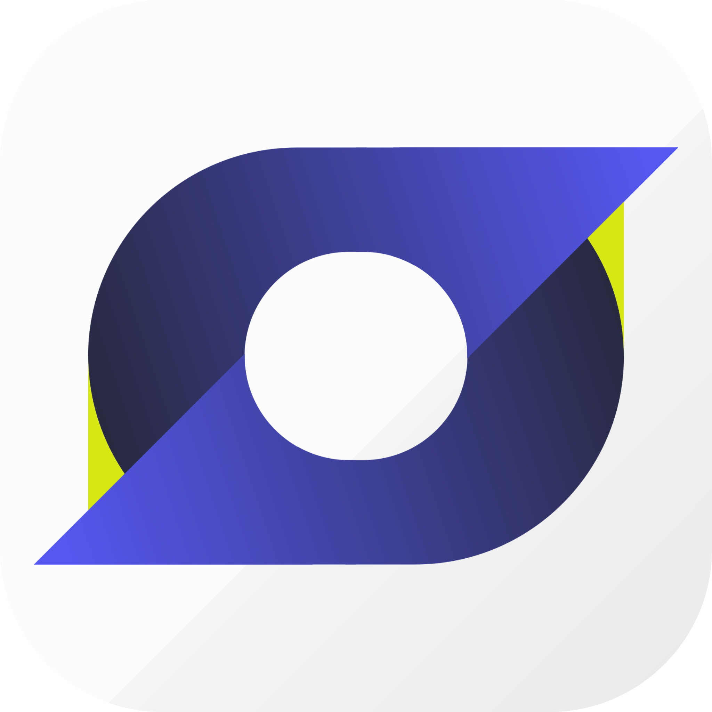
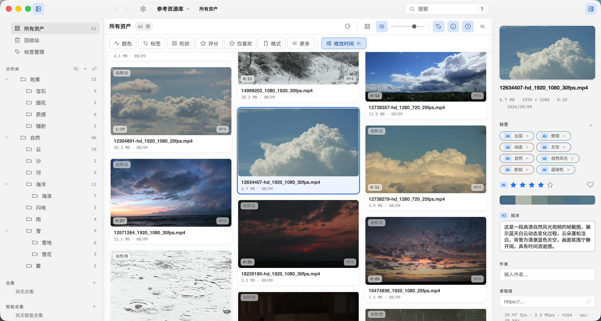

<div align="center">

[🇺🇸 English](README.en.md) | **🇨🇳 简体中文**

</div>

# Serpent

<div align="center">



</div>

开源（MIT）、跨平台（macOS / Windows）的数字资产管理软件，面向游戏美术、影视后期、平面/动态图形设计师。

主页：[serpent.dolag.work](https://serpent.dolag.work) · [在线文档](https://serpent.dolag.work/docs/user-guide/) · [下载最新版本](https://github.com/dolag233/Serpent/releases) · [浏览器扩展](https://github.com/dolag233/Serpent-Extension/releases)

## 特性

+ 支持**海量**资产类型。支持大多数视频、图像、音频格式。额外支持3D模型、文本类型资产。
+ 资产管理系统。支持对资产添加标签、打分、添加描述等功能。支持快速过滤和搜索。支持添加合集。
+ 支持插件系统。支持用插件扩展Serpent功能。
+ 支持脚本、MCP调用。支持使用脚本控制Serpent。支持Agent通过MCP连接、控制Serpent，以实现自动化管理。
+ 支持AI分析。内置AI分析模块，支持对图像、视频、3D资产进行AI分析。
+ 支持WebDAV云同步。多台设备间双向同步资源库，支持自动同步与可配置的轮询间隔。
+ 支持打开外部资源库。可直接打开 Eagle / Billfish 资源库，转换后无缝浏览与检索。

<div align="center">



</div>

## 安装

从 [GitHub Releases](https://github.com/dolag233/Serpent/releases) 下载最新安装包。

**macOS**：下载 `Serpent-<版本>-arm64.dmg`，拖入「应用程序」。首次打开时 macOS 会提示"无法验证开发者"，右键点击应用 → 打开（仅首次），或运行：

```bash
xattr -cr /Applications/Serpent.app
```

**Windows**：运行 `Serpent-<版本> Setup.exe`。未签名版本首次运行会显示 SmartScreen 警告，选择「更多信息 → 仍要运行」。

**浏览器扩展**：从[浏览器扩展发布页](https://github.com/dolag233/Serpent-Extension/releases)下载。安装后打开 `chrome://extensions`，开启开发者模式，加载已解压的扩展：

- macOS：`Serpent.app/Contents/Resources/extension`
- Windows：安装目录 `resources/extension`

## 本地构建

要求 Node.js 24.15.0（见 `.nvmrc`）。原生开发目标为 macOS arm64 与 Windows x64。不要在 SMB/NAS 挂载目录上构建。

```bash
npm ci --registry=https://registry.npmjs.org
npm run rebuild:native   # 对齐 better-sqlite3 与 Electron ABI（校验 FTS5）
npm start
```

常用命令：

```bash
npm run lint             # ESLint
npm run typecheck        # tsc --noEmit
npm run test             # 单元 + Worker 集成测试
npm run test:e2e         # Playwright E2E
npm run package          # 打包到 out/Serpent-<platform>-<arch>/
npm run make             # 按平台生成安装包（macOS dmg / Windows zip；Windows 安装器用 Inno Setup 构建）
```

完整的构建、打包、发布流程见[开发者文档](docs/developer/build-packaging.md)。

## 文档

| 文档 | 内容 |
| --- | --- |
| [使用手册](docs/user-guide/README.md) | 安装、导入、浏览、搜索、标签、合集、3D 查看、故障排查 |
| [在线文档](https://serpent.dolag.work/docs/user-guide/) | 浏览器中阅读最新使用手册 |
| [开发者文档](docs/developer/README.md) | 环境搭建、构建打包、架构、测试 |
| [扩展作者手册](docs/manual/README.md) | 插件 / 脚本 / MCP |
| [产品简报](docs/product-brief.md) | 产品愿景与 MVP 边界 |

## 许可证

MIT。内置媒体组件与资产遵循各自许可（FFmpeg LGPL、OpenImageIO、ufbx MIT、Poly Haven CC0），见各 `resources/` 目录的 LICENSE 文件。
