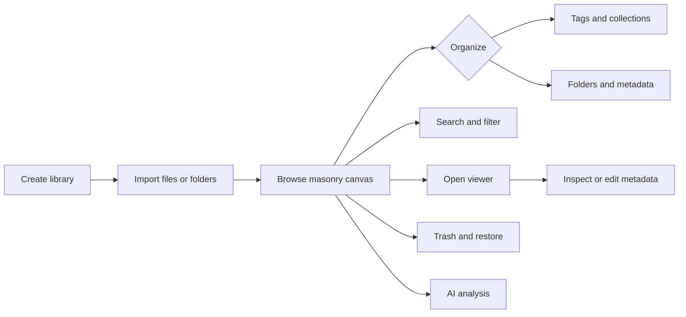

# User Guide

A Serpent usage guide for end users. Chinese version: [README.md](README.md)

- [Install](installation.en.md) — macOS / Windows, upgrades
- [Basics](basics.en.md) — libraries, importing, browsing, organization, file actions, and the viewer
- [Search and filters](search-and-filters.en.md) — advanced query syntax, filter dimensions, and Shift multi-select
- [WebDAV cloud sync](sync.en.md) — server configuration, library binding, auto-sync, opening remote synced libraries
- [AI analysis](ai.en.md) — supported assets, automatic/manual analysis, jobs, and privacy
- [Browser extension](browser-extension.en.md) — save web images/videos from Chrome / Edge / Firefox
- [Using plugins](plugins.en.md) — install, enable, update, and uninstall plugins
- [Automation](automation.en.md) — automation scripts and MCP client connections
- [Troubleshooting](troubleshooting.en.md) — common problems and fixes

## Quick start

1. Install Serpent (see [Install](installation.en.md))
2. Launch the app and create a local library
3. Drag images, videos, audio, 3D models, or text into the window, or click Import
4. Assets appear on the canvas. Double-click to open the viewer; right-click for more actions. Thumbnails, metadata, and AI analysis complete progressively in the background

Data stays in your local library directory; for syncing across machines, use WebDAV cloud sync (see [Sync](sync.en.md)).

## Interface at a glance

A typical workspace has library navigation on the left, the asset canvas in the center, and the Inspector on the right. On Windows, the upper-left Main menu contains File, Edit, Window, Library, and Settings; macOS also exposes the same commands in the native menu. Import, search, filtering, and sorting stay in the top toolbar.

See [Basics](basics.en.md) for the complete workflow.

## Documentation status

This directory describes the current user-facing product. Screens and available features can change between releases; follow the latest installer and release notes.
