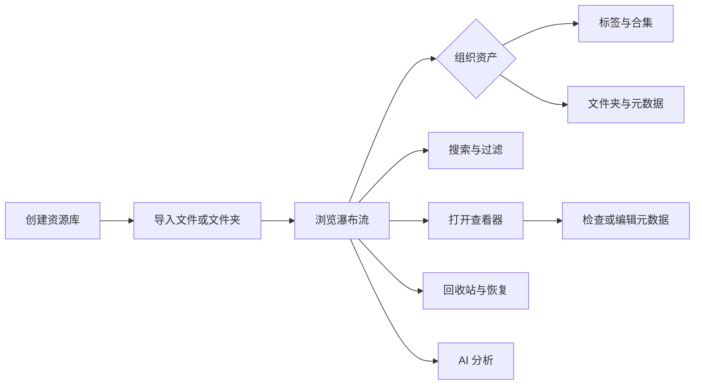

# 使用手册

面向最终用户的 Serpent 使用指南。英文版：[README.en.md](README.en.md)

- [安装](installation.md)——macOS / Windows 安装、升级
- [基本使用](basics.md)——资源库、导入、浏览、标签、合集、文件操作和查看器
- [搜索与过滤](search-and-filters.md)——高级搜索语法、过滤维度和 Shift 多选
- [WebDAV 云同步](sync.md)——服务器配置、资源库绑定、自动同步与打开远端同步库
- [AI 分析](ai.md)——支持的资产、自动/手动分析、任务进度和隐私提示
- [浏览器扩展](browser-extension.md)——Chrome / Edge / Firefox 保存网页图片视频
- [插件使用](plugins.md)——安装、启用、更新和卸载插件
- [自动化功能](automation.md)——自动化脚本和 MCP 外部客户端连接
- [故障排查](troubleshooting.md)——常见问题与解决

## 快速开始

1. 安装 Serpent（见[安装](installation.md)）
2. 启动应用，创建本地资源库
3. 把图片、视频、音频、3D 模型或文本拖入窗口，或点击「导入文件」
4. 资产出现在画布中。双击打开查看器，右键查看更多操作；缩略图、元数据和 AI 分析会在后台渐进完成

数据保存在本机资源库目录；如需多台电脑间同步，可使用 WebDAV 云同步（见[同步](sync.md)）。

## 界面速览

典型工作区由左侧资源库导航、中部资产画布和右侧 Inspector 组成。Windows 使用左上角「主菜单」承载文件、编辑、窗口、资源库和设置；macOS 还提供同内容的系统菜单。导入、搜索、过滤和排序集中在顶部工具栏。

完整流程见[基本使用](basics.md)。

## 功能状态说明

本目录说明当前版本的用户功能。不同版本的界面和可用功能可能略有变化，请以最新安装包和发行说明为准。
