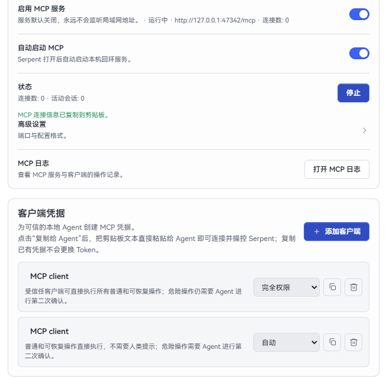

# 自动化功能

Serpent 提供两种自动化方式：用脚本批量整理资产，或让外部 AI 工具通过 MCP 连接 Serpent。普通浏览、导入和查看不需要使用这些功能。

## 自动化脚本

脚本适合重复性的整理工作，例如批量添加标签、调整评分或把资产移动到指定文件夹。

1. 先打开一个资源库。
2. 打开「更多工具」→「自动化脚本」。
3. 新建或打开脚本，先阅读内容，再点击运行。
4. 运行后回到资源浏览界面检查结果；不确定时先用少量资产试运行。

脚本只通过 Serpent 提供的操作来修改资源库，不会替你执行电脑上的任意程序。运行前仍应确认脚本来自可信来源，并备份重要资源库。

## 连接外部 AI 工具（MCP）

MCP 是一种让外部 AI 工具读取和整理 Serpent 资产的连接方式。它只在本机工作，不会自动把资源库公开到互联网。

### 最简单的使用方式

1. 打开「设置」→「MCP」。
2. 打开 MCP 服务，并按需要打开「自动启动」。
3. 点击「添加客户端」，选择要使用的客户端格式。
4. 点击客户端连接行的复制按钮（“复制给 Agent”）。
5. 将剪贴板中的**全部文本**直接粘贴给 Agent，不要手动拆分地址或授权信息；其中包含 Agent 连接 Serpent 所需的内容和使用提示。

默认连接地址是 `http://127.0.0.1:47342/mcp`。每个客户端连接都有自己的授权。请妥善保护复制出的连接信息；不再使用某个客户端时，可以在 MCP 设置中撤销它。

Agent 连接后会从 MCP 的服务器说明和 `tools/list` 自动获知基本用法，再调用 `serpent_library_list_open` 或 `serpent_library_list_recent` 获取 `libraryId`。如果 Agent 询问要操作哪个资源库，让它先列出资源库并使用返回的 ID。所有资源库相关操作都必须明确带上这个 `libraryId`；删除等关键操作还需要 Agent 的二次确认。

只给可信的本地 AI 工具开启连接。涉及删除、移动等有影响的操作时，Serpent 仍会要求确认。

## 更多资料

脚本和 MCP 的完整命令、开发方法和接入示例见[扩展作者手册](../manual/README.md)。
