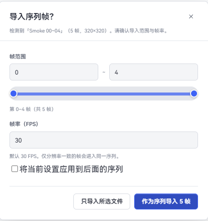
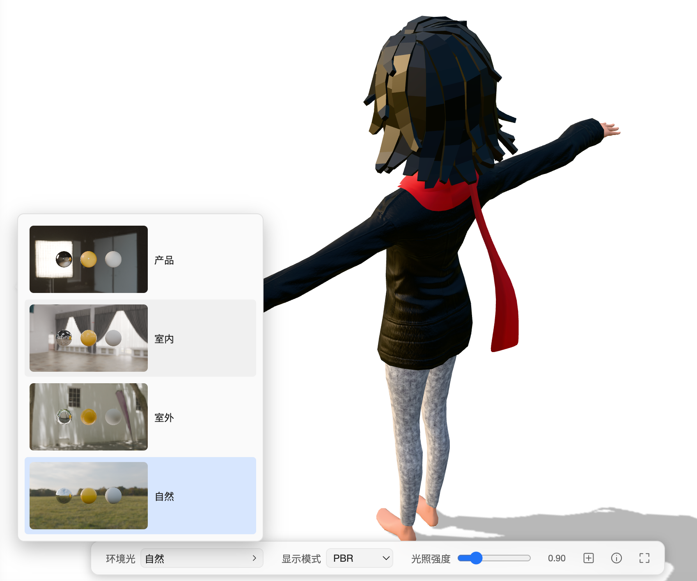

# 基本使用

## 创建、打开和设置资源库

首次启动时选择「创建资源库」，指定存放位置和显示名称即可。资源库目录包含托管资产、数据库和 `.serpent/` 工作目录；显示名称只影响 Serpent 中的显示，不会移动资源库目录。

之后可以从左上角「主菜单」→「资源库」创建、打开、导入或导出资源库。资源库菜单中的「资源库设置」可以修改名称、查看位置，并编辑当前库的忽略配置文件。简介字段目前尚未提供。

资源库设置的「忽略规则」使用类似 `.gitignore` 的每行规则，文件名对用户显示为“忽略配置文件”，实际保存在资源库目录中。保存后立即影响浏览、搜索和扫描：

```text
*.tmp                 # 忽略所有 .tmp 文件
参考/草稿/             # 忽略该文件夹
!参考/草稿/保留.png    # 取消某个文件的忽略
```

问号帮助会说明 `*`、`?`、`**`、目录末尾 `/`、根目录开头 `/` 和 `!` 否定规则。

### 打开外部资源库（Eagle / Billfish）

「打开资源库」→「打开外部资源库…」→ 选择 **Eagle** 或 **Billfish**：

1. 选择源库（Eagle/Billfish 的资源库目录或其归档压缩包）；
2. 选择 Serpent 的保存位置；
3. Serpent 会转换源库并在目标位置创建本地库（大型 Eagle 库首次转换可能需要数分钟）。

转换完成后，浏览、搜索、标签、AI 分析等体验与本地资源库一致，原库文件不会被改动。


## 导入资产

可以拖入单个文件、多个文件、多个文件夹或混合选择，也可以使用工具栏/主菜单中的「导入文件」「导入文件夹」。文件夹会递归扫描；浏览器扩展还支持把网页图片或视频右键保存、或直接拖拽保存。

当前产品注册的常用格式如下（实际解码仍可能受文件编码和源文件完整性影响）：

- 图像：PNG、JPG/JPEG、GIF、TIFF/TIF、WebP、SVG、BMP、ICO、PSD、EXR、TGA
- 相机 RAW：DNG、CR2、CR3、NEF、ARW、RAF、ORF、RW2
- 视频：MP4、MOV、AVI、WMV、WebM、MKV、M4V
- 音频：WAV、MP3、OGG/OGA、M4A、AAC、FLAC、Opus（生成波形封面并在查看器播放）
- 3D：FBX、OBJ、GLTF、GLB、STL（FBX 会先转换为可查看的 GLB）
- 文本：TXT、Markdown、JSON、CSV、XML、YAML、代码文件等常见文本格式

导入时文件会复制到资源库的资产目录并建立稳定资产 ID。同名或内容重复会打开冲突处理窗口。导入完成后缩略图、技术元数据和符合条件的 AI 分析在后台生成，不需要等待全部任务结束才能继续浏览。

#### 序列帧导入

在「设置」→「资产」中可以开启或关闭「导入时自动检测序列帧」（默认开启）。开启后，拖入或使用「导入文件」选择一组连续编号、尺寸一致的图片（如 `00001.png`…`00150.png`）时，Serpent 会识别为序列并弹出序列导入对话框，可设置 FPS；关闭后会按普通图片导入。导入后作为一套可播放的资产在查看器中播放，也可以「解散」回单帧。



在序列帧导入窗口中，可以调整帧范围和 FPS，然后选择只导入当前文件，或将所选帧作为序列导入。

## 浏览和组织

- 左侧导航：所有资产、回收站、文件夹、合集和智能合集。文件夹与合集可以按需要包含子项；合集是多对多关系，同一资产可加入多个合集。
- 中部画布：支持平铺、瀑布流和文件夹/合集卡片。拖动左右侧栏或缩放画布时，布局会重新计算；窗口会尽量保持原来的滚动位置。
- 顶部工具栏：搜索、过滤、排序、视图和资产显示字段。非画布页面会隐藏不适用的视图控件。
- 右侧 Inspector：显示当前选中资产的文件信息、标签、评分、喜欢、描述、来源链接、作者、技术元数据、色彩空间和 AI 内容。

单击选择，双击打开查看器；拖拽画布空白区域可框选，macOS 使用 `⌘`、Windows 使用 `Ctrl` 加单击可增选。按 `Tab` 在资产间移动焦点，`Shift` 结合选择操作可连续选择。文件夹、合集和智能合集支持右键操作、`F2` inline 重命名和 `Delete` 删除；包含内容时会先确认，删除合集不会删除其中的资产。


## 查看器

双击资产打开查看器。图片、SVG、RAW、PSD、TIFF、TGA、EXR 等会通过相应的解码/代理路径显示；SVG 在查看器中按矢量源渲染，而不是把缩略图当作最终图像。视频默认循环播放，必要时由 Serpent 生成兼容代理；音频显示波形并提供播放控制；3D 模型使用独立的模型查看器。PDF 文件使用内置的 pdf.js 查看器按页渲染。

查看器支持平移、滚轮缩放、居中适配（小键盘 `.`）、全屏以及图片/视频的旋转和水平/垂直镜像。PDF 预览支持缩放（0.25×–8×）、平移和页面适配；滚动缩放以鼠标指针为锚点。非 PNG/JPEG 的图像可能包含文件色彩空间信息；查看器会优先使用读取到的色彩空间，并允许在可用选项间切换。EXR 可在存在多个 plane/part 时选择显示项，但这不是专业通道调色工具。



## 标签、合集和智能合集

- 标签可从 Inspector 或资产右键菜单添加，标签菜单支持搜索、最近使用和批量操作。
- 合集是手动维护的资产关系，可把资产拖入合集或使用「添加到合集」二级菜单；从合集视图删除只会移除关系。
- 智能合集保存搜索词、过滤和排序定义，打开时实时计算结果。

## 回收站与删除

普通 `Delete`/macOS `⌘⌫` 将资产或文件夹移入回收站，可以恢复；Windows `Shift+Delete`、macOS `⌥⌘Delete` 从硬盘删除，执行前会显示确认。通知中的回撤图标可以撤回最近一次可撤销文件操作，恢复后当前视图会刷新。

## 链接文件夹

「文件」菜单中的「导入链接文件夹」可以引用资源库目录之外的文件夹（如项目或素材目录）。资产不会被复制进资源库，而是原位引用原文件夹中的文件；你可以稍后把链接文件夹复制进库内（转为托管）、重新链接（relink）或设置规则。

## WebDAV 云同步

Serpent 支持通过 WebDAV 在多台电脑之间同步资源库：全局配置服务器、每个资源库绑定、自动同步与轮询间隔、打开远端同步库。详见《[同步与外部资源库](sync.md)》。

## 快捷键

| 操作 | macOS | Windows |
| --- | --- | --- |
| 打开查看器 | Enter | Enter |
| 外部应用打开 | ⌘O | Ctrl+O |
| 在文件管理器中显示 | ⌘⇧S | Ctrl+Shift+S |
| 聚焦搜索 | ⌘F | Ctrl+F |
| 重命名 | F2 | F2 |
| 移入回收站 | ⌘⌫ | Delete |
| 从硬盘删除 | ⌥⌘Delete | Shift+Delete |
| 复制 / 粘贴 | ⌘C / ⌘V | Ctrl+C / Ctrl+V |
| 查看器居中适配 | 小键盘 `.` | 小键盘 `.` |

更多搜索和过滤用法见[搜索与过滤](search-and-filters.md)，AI 设置和队列见[AI 分析](ai.md)。
