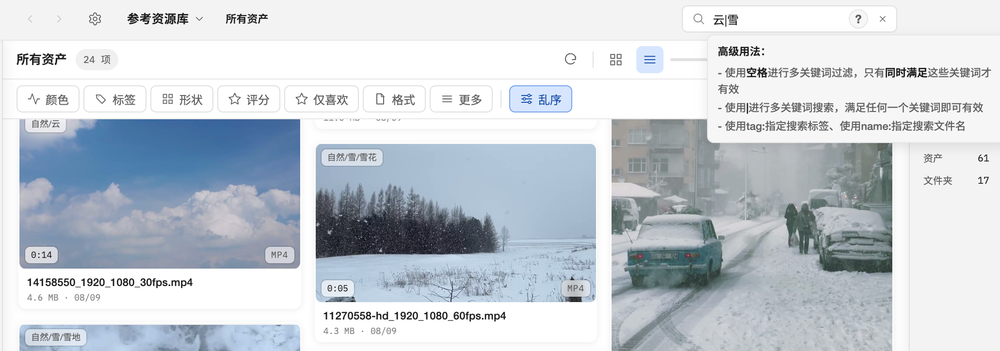
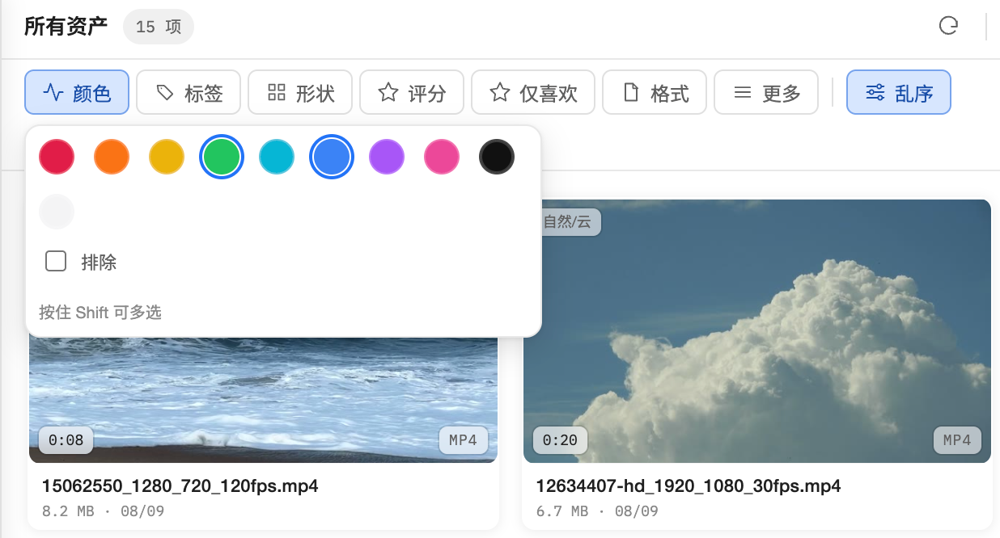

# 搜索与过滤

## 搜索范围和更新

搜索只作用于当前可浏览范围：当前文件夹/合集、是否包含子文件夹或子合集、以及已启用的结构化过滤条件共同决定结果。它不会因为输入关键字而偷偷切换到整个资源库。输入后约 200 ms 自动更新，按 Enter 也可以立即提交；结果按分页渐进加载。

搜索覆盖文件名、标签、描述（包括 AI 描述）、来源 URL、作者、文件夹路径和可检索元数据。普通关键词是大小写不敏感的包含匹配。

## 高级搜索语法

悬停或键盘聚焦搜索框右侧的 `?` 可以随时查看提示。语法由简单的词组组成：

| 写法 | 含义 | 示例 |
| --- | --- | --- |
| 空格 | 同一组中的 AND，所有词都要匹配 | `poster blue` |
| `\|` | OR，任意一组匹配即可 | `poster \| cover` |
| 开头 `-` | 排除该条件 | `-tag:草稿` |
| 双引号 | 保留短语中的空格和 `\|` | `"hero concept"` |
| `字段:值` | 只在指定字段搜索 | `author:Jane` |

支持的字段别名：

- 文件名：`name:`、`filename:`
- 标签：`tag:`、`tags:`
- 描述：`desc:`、`description:`
- 来源 URL：`source:`、`url:`、`link:`、`source_url:`
- 作者：`author:`
- 文件夹路径：`path:`、`folder:`、`folder_path:`
- 元数据：`meta:`、`metadata:`、`metadata_text:`

例如：

```text
name:"hero concept" -tag:草图 | author:Jane
```

这表示“文件名包含 hero concept 且不是草图标签，或者作者是 Jane”。不写字段时，会在上述可搜索字段中查找。宽度、高度、长边和时长属于结构化过滤，不是搜索运算符。



## 过滤

过滤器在搜索框旁的「过滤」按钮中，按维度组织；多个维度同时启用时按 AND 组合。同一维度的多个值按 OR 组合。当前维度包括：

- 颜色：红、橙、黄、绿、青、蓝、紫、粉、黑、白
- 标签：可搜索标签、常用标签和最近筛选
- 形状：横图/竖图、16:9、4:3、1:1、3:4、9:16 等预设，也可填写自定义宽高比
- 评分：未评分到 5 星
- 格式：图像、视频、音频、3D、文本和逐扩展名选择
- 更多：喜欢、是否有来源 URL、可用性（可用/文件丢失）、长边分辨率、宽度、高度和时长范围

同一维度的颜色、标签、评分、格式和形状预设支持按住 **Shift** 点击进行多选；再次 Shift 点击已选值会移除它。普通点击会替换该维度的选择，单击唯一选中值可清除该维度。不同维度仍然是 AND。更多中的布尔条件和数值范围按各自字段组合，不要把一个范围误当成多个离散值。

过滤面板底部也会显示“按住 Shift 可多选”。启用的条件会显示为可移除的过滤标签，点击「全部清除」可一次清空。



## 排序和智能合集

排序可按名称、修改时间、创建时间、文件大小、分辨率、时长、评分、颜色或作者升序/降序，也可选择乱序。搜索词、过滤条件和排序可以保存为智能合集；智能合集打开时重新计算，结果随资产变化而更新。
