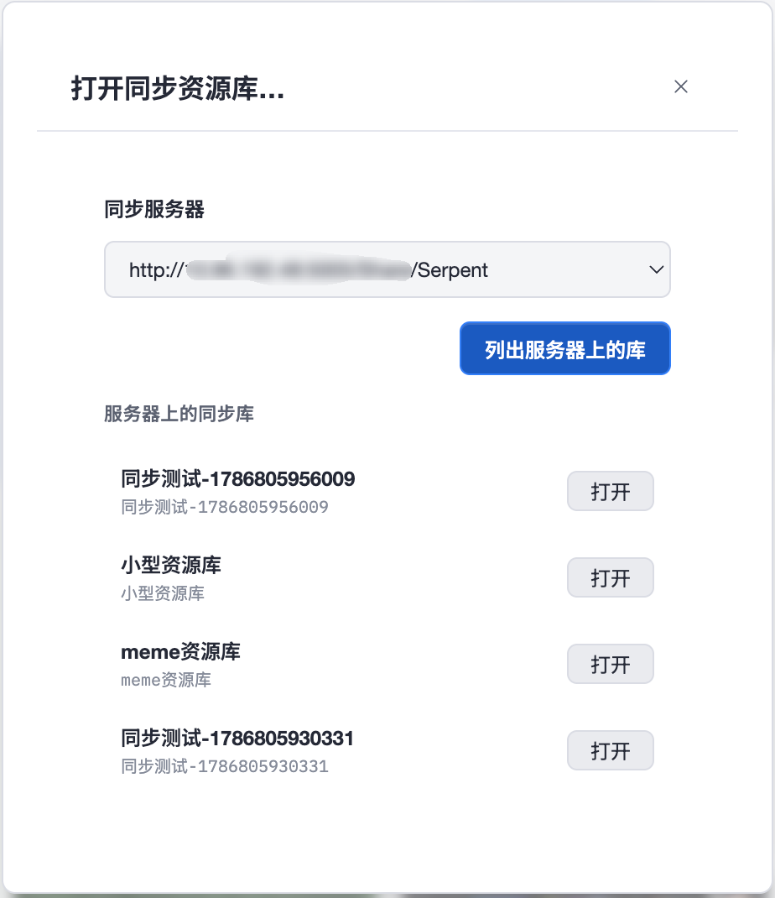

# WebDAV Cloud Sync

Serpent can sync a library across machines over WebDAV. Configure servers globally, bind each library individually, and Serpent syncs both ways automatically: local changes upload, remote changes pull.

## Sync overview

- Configure one or more WebDAV servers in **General settings**; each library binds to one server and a remote folder.
- Sync is bidirectional: local imports, edits, and deletions upload automatically; remote changes are pulled to the local library.
- Auto-sync is per library: after saving a binding it runs once immediately, then checks the server for changes on the configured poll interval; local asset changes upload about 10 seconds after they happen.
- A toast appears in the bottom-right while syncing or when sync completes; the library switcher (top-left, next to the library name) shows a connection icon — green link = auto-sync on, grey link-off = off (hover for details).

## Configure a WebDAV server (General settings)

Open **General settings** → **Sync** to add a sync server:

- **Server address**: must start with `http://` or `https://`; use the WebDAV path of your NAS or shared folder (for example `https://nas.local/dav/share/`).
- **Username / password**: server credentials. The password is encrypted with the system secure storage (macOS Keychain / Windows DPAPI) and never stored in plain text.
- **Allow self-signed certificate or HTTP**: enable for self-hosted servers without a proper certificate.
- After saving you can test the connection; failures show an actionable reason (invalid address, DNS, TLS, authentication, …).

## Bind a library (Library settings)

Open **Library settings** → **Sync**:

- **Sync status**: shows not synced / syncing / last synced time.
- **Server**: the server this library binds to; switching servers tests the connection automatically.
- **Sync folder name**: the remote folder name, defaults to the library name. The remote location is `server address/folder name/`.
- **Auto sync**: when on, local changes upload and remote changes pull automatically.
- **Poll interval (seconds)**: how often remote changes are checked, 5 seconds by default. **For large libraries, consider a longer interval** to avoid frequent checks weighing on the network and disk.
- **Save**: persists the binding; turning auto-sync on triggers a sync immediately.

## Sync behavior

- **The first sync uploads assets, metadata, and a manifest to the server**; later syncs transfer only changed files.
- If two machines edit the same file, the losing version is kept as a “name (conflict-…)” copy instead of being silently overwritten.
- Auto-sync and manual sync are mutually exclusive; a failed sync only writes a log entry and does not interrupt you.

## Open a synced library

**Open library** → **Open synced library…**:

1. Choose a configured server;
2. the panel lists synced libraries on that server (recognized by their remote manifest, so you can continue on another device);
3. pick a local destination and open — remote content is downloaded locally.

The server must support file upload/download (PUT/GET).

