

# SHUO Canvas

**把想法，连成作品。**

*Create your world.*

**AI 多模态创作画布**

把文字、图片、视频和音频放进同一个画布，用节点连接起来完成创作。

支持 RunningHub AI 应用和 ComfyUI 本地、云端工作流。

> 原 **AI-CanvasPro**（**AI Canvas Pro / AI CanvasPro**）现已更名为 **SHUO Canvas**，仍是同一个项目。

## 🖼️ 产品展示

  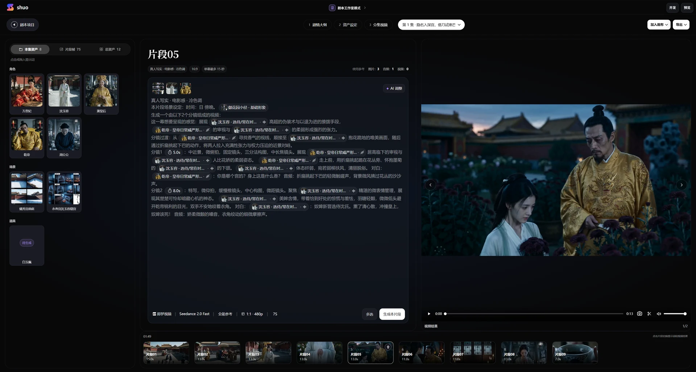
   
  <strong>剧本工作室</strong> · 从资产设定、分镜生成到成片预览

  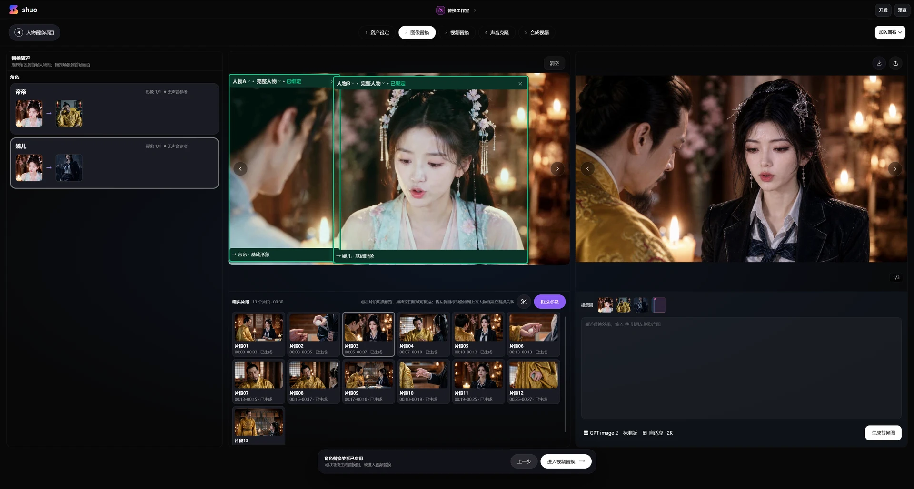
   
  <strong>人物替换工作室</strong> · 跨镜头管理角色并完成图像、视频替换

<table>
  <tr>
    <td width="50%" align="center">
      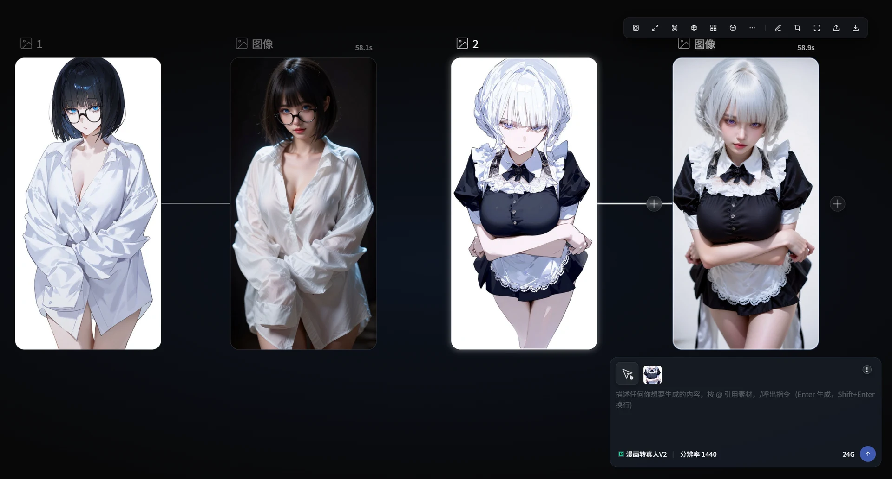
       
      <strong>参考图生成</strong> · 连接素材并生成新图像
    </td>
    <td width="50%" align="center">
      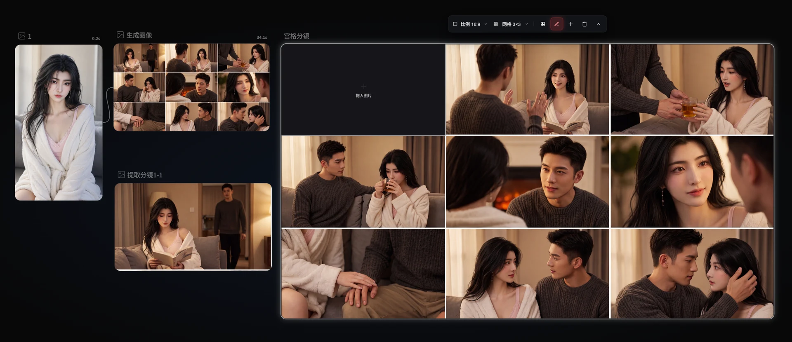
       
      <strong>宫格节点</strong> · 批量组织和拆解分镜
    </td>
  </tr>
  <tr>
    <td width="50%" align="center">
      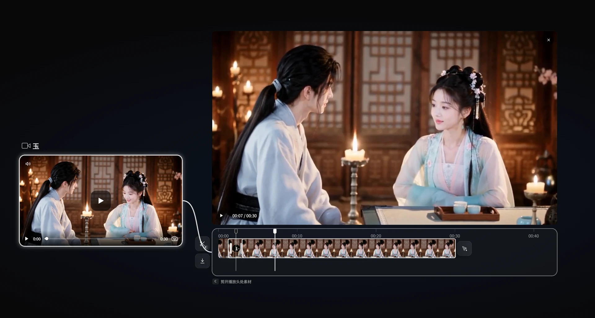
       
      <strong>剪辑节点</strong> · 在画布内完成时间线裁剪与预览
    </td>
    <td width="50%" align="center">
      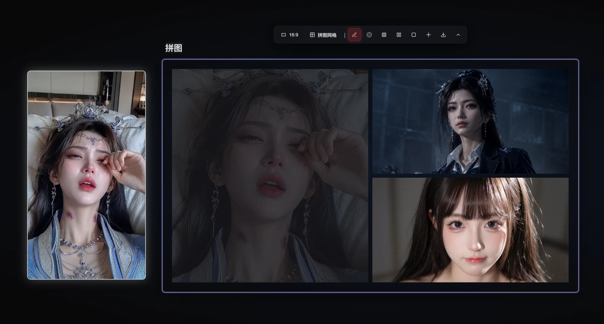
       
      <strong>拼图节点</strong> · 自由组合多张图片
    </td>
  </tr>
</table>

<table>
  <tr>
    <td width="50%" align="center">
      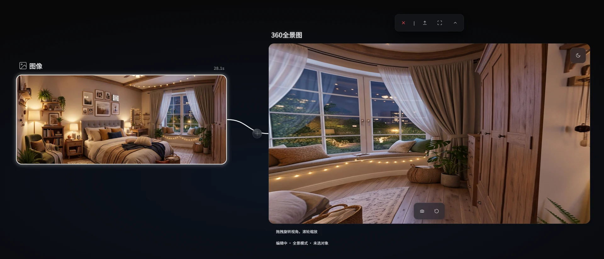
       
      <strong>360° 全景图</strong> · 从普通图像生成可交互的全景空间
    </td>
    <td width="50%" align="center">
      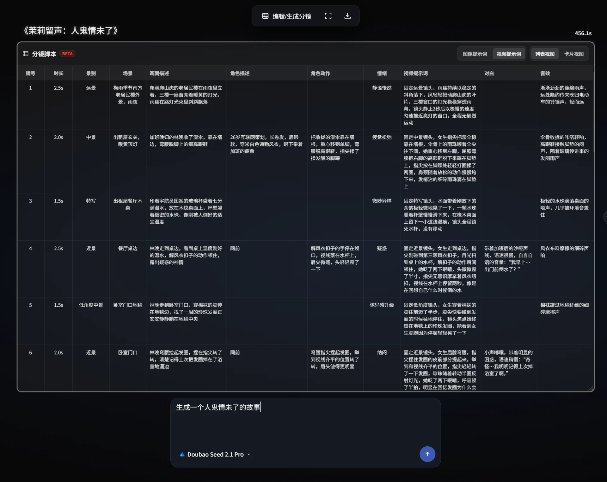
       
      <strong>分镜脚本节点</strong> · 生成和编辑镜头、场景、动作、对白与音效
    </td>
  </tr>
</table>

<table>
  <tr>
    <td width="50%" align="center">
      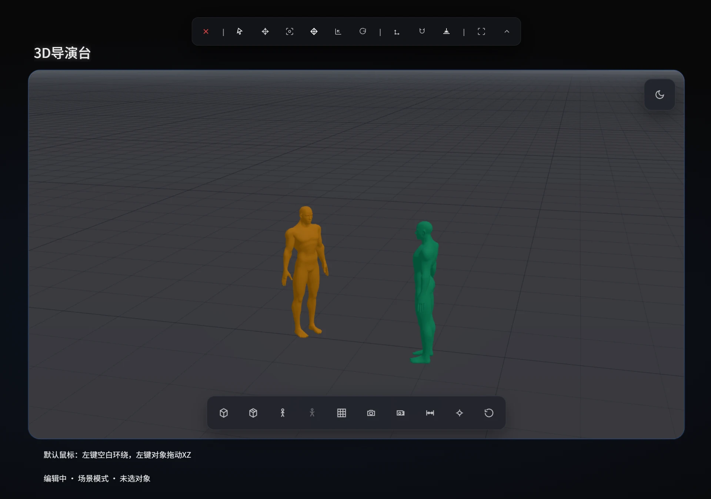
       
      <strong>3D 导演台</strong> · 编排场景、角色走位与镜头
    </td>
    <td width="50%" align="center">
      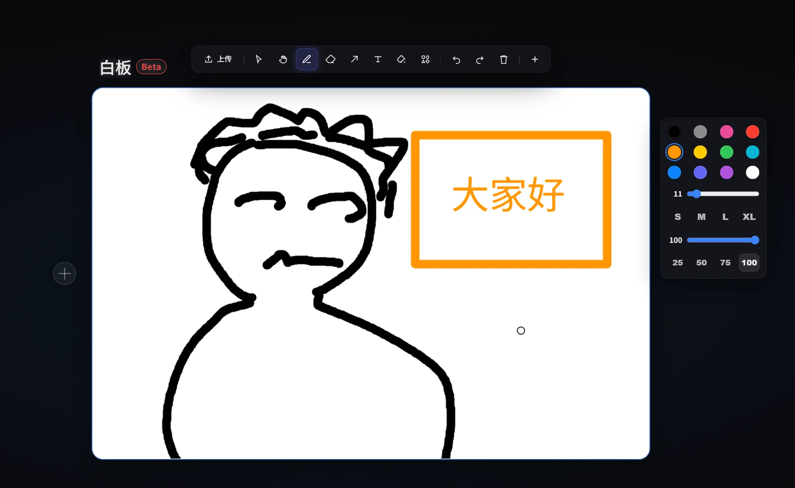
       
      <strong>白板节点</strong> · 草图、标注与创意协作
    </td>
  </tr>
</table>

<table>
  <tr>
    <td width="50%" align="center">
      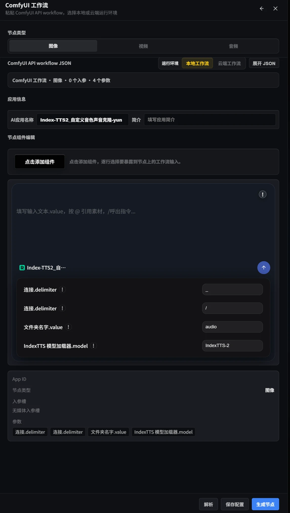
       
      <strong>RH / ComfyUI 工作流</strong> · 导入本地与云端工作流
    </td>
    <td width="50%" align="center">
      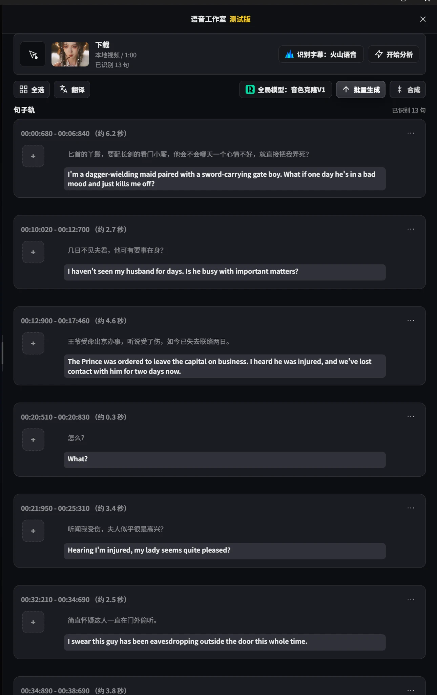
       
      <strong>语音工作室</strong> · 字幕识别、翻译与批量配音
    </td>
  </tr>
</table>

## 视频教程

- [快速入门](https://www.bilibili.com/video/BV1RX5z6gEXq/)
- [剧本工作室](https://www.bilibili.com/video/BV1stKM6mEXT/)
- [RunningHub / ComfyUI 接入](https://www.bilibili.com/video/BV1VqT764E7d)

查看更多教程

- [全音频参考生成视频](https://www.bilibili.com/video/BV16wMe6EE3m)
- [影视二创与语音工作室](https://www.bilibili.com/video/BV1nX7n6uEbi/)
- [浏览器节点](https://www.bilibili.com/video/BV1Q87u6sEpM/)
- [Seedance 2.0 线条控制运镜](https://www.bilibili.com/video/BV1ZzjL6UEoA/)
- [Scail2 使用方法](https://www.bilibili.com/video/BV16DJH6jEmk/)
- [RunningHub Bernini 模型](https://www.bilibili.com/video/BV1TwEb6gEsC)
- [游戏制作](https://www.bilibili.com/video/BV17soQB7EwB)
- [影视人物替换](https://www.bilibili.com/video/BV1YEDKBwEz7)
- [360° 全景图与人物一致性](https://www.bilibili.com/video/BV1FqdyBwEGx)

## ✨ 主要功能

- **AI 生成**：文字、图片、视频和音频。
- **影视创作**：剧本、分镜、人物替换、语音和 3D 场景。
- **素材处理**：裁剪、拼图、抠图、擦除、高清、抽帧和对口型。
- **工作流接入**：RunningHub AI 应用、ComfyUI 本地和云端工作流。
- **画布操作**：拖拽、连线、多选、编组、对齐和撤销重做。

### 💾 项目管理

- 支持多个项目切换。
- 自动缓存，刷新后可恢复画布。
- 第一次安装时，数据默认保存在系统盘；可在 **设置 → 文件与保存** 中修改。
- 换电脑时，使用“项目资源收集”或 `.aicpkg` 项目包。

### 🧠 创作辅助

- 输入 `@`，引用画布里的文字或素材。
- 输入 `/`，快速插入提示词模板。
- 使用右下角 Agent，让 AI 帮你操作画布。

## 🚀 下载与使用

1. **下载软件**
   - [GitHub 最新版](https://github.com/ashuoAI/SHUO-Canvas/releases/latest)
   - [GitHub 全部版本](https://github.com/ashuoAI/SHUO-Canvas/releases)
   - [百度网盘](https://pan.baidu.com/s/1igcxiCGpAd_CFoj9Am2s-g)，提取码：`8848`
2. **选择安装包**
   - Windows：下载 `SHUO-Canvas-windows-*.exe`
   - macOS M 系列：下载 `SHUO-Canvas-Mac-arm64-*.dmg` 或 `.zip`
3. **开始使用**
   - 安装后打开软件，在 **设置 → API 输入** 中填写 API Key。

> 从 v0.7.0 开始，安装包与安装后的软件统一使用 **SHUO Canvas** 名称。

当前版本：[v0.7.8](https://github.com/ashuoAI/SHUO-Canvas/releases/tag/v0.7.8) · [更新说明](./release_notes.txt)

## ⚙️ 配置 API Key

> **收费说明：** SHUO Canvas 只收软件激活费用，不按模型调用次数收费。模型费用由你使用的 API 平台收取。
>
> 生成内容能否商用，请查看对应 API 平台的规定。

打开 **设置 → API 输入**，填写 API Key 后保存。

| 平台 | 获取方式 |
| --- | --- |
| 即梦官方 | 在“API 输入”页面底部扫码登录 |
| RunningHub 国内 | [获取 Key](https://www.runninghub.cn/?inviteCode=rh-v1312) |
| RunningHub 国际 | [获取 Key](https://www.runninghub.ai/?inviteCode=rh-v1312) |
| APImart | [获取 Key](https://apimart.ai/zh/register?aff=ashuoai) |
| 派欧云 PPIO（计划下架） | [获取 Key](https://ppio.com/user/register?invited_by=SF4VL3) |
| GRSAI | [获取 Key](https://grsai.com/zh/dashboard/user-info) |
| 火山引擎 | [控制台](https://console.volcengine.com/ark/) · [文档](https://www.volcengine.com/docs/82379/1541594) |
| 通用 OpenAI 接口 | 在设置中填写接口地址和 Key |

## ⌨️ 常用操作

| 操作 | 作用 |
| --- | --- |
| 双击画布 | 添加 AI 节点 |
| 左键拖拽 | 移动节点 |
| `Alt` + 拖拽节点 | 复制节点并保留连线 |
| `Shift` + 点击 | 多选节点 |
| 右键画布 | 打开菜单 |
| 滚轮 | 缩放画布 |
| 中键或空格拖拽 | 平移画布 |
| `Ctrl+C / Ctrl+V` | 复制 / 粘贴节点 |
| `Ctrl+A` | 全选节点 |
| `Ctrl+S` | 保存 |
| `Ctrl+Z / Ctrl+Shift+Z` | 撤销 / 重做 |
| `F` | 显示全部节点 |
| `D` | 删除选中节点 |
| `Esc` | 关闭菜单或弹窗 |
| 节点左侧 `+` | 添加节点 |

以上为“阿硕预设”。可在 **设置 → 快捷键** 中修改或查看更多快捷键。

## 👤 联系与反馈

- 作者：阿硕
- 微信：`shuoerone`
- [Bilibili 主页](https://space.bilibili.com/1876480181)
- [提交建议或问题](https://i1etb6xynr.feishu.cn/wiki/N2C3wD6SgisOpek11mfcfJCinkr?from=from_copylink)

## 授权说明

SHUO Canvas 是公开下载的桌面软件，但不是开源软件。

- 软件使用与分发规则：[LICENSE](./LICENSE)
- 软件商业授权：[COMMERCIAL-LICENSE.md](./COMMERCIAL-LICENSE.md)，或联系作者
- 请从官方发布页下载，不要在非官方网站输入 API Key 或激活码
